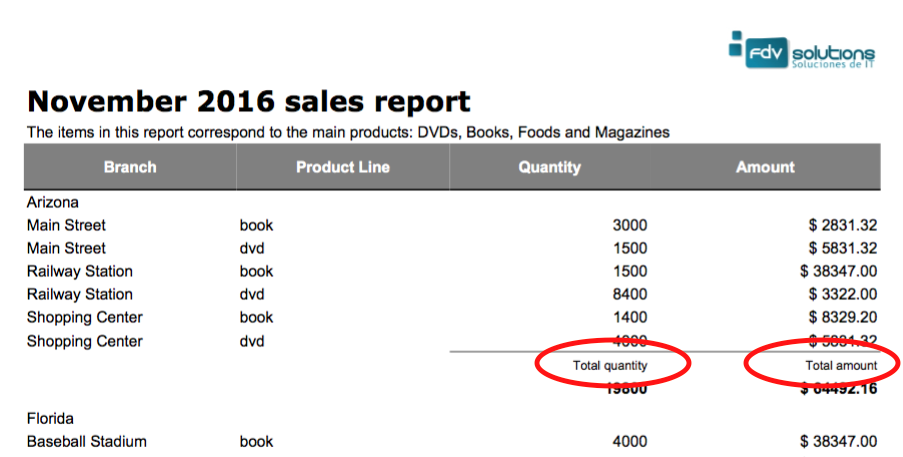

Add labels in group header and footer
=====================================

This feature (added in v3.0.7) enables to have labels in group header and footer, specially for each variable (on top of it) or a general label for all variables at the left.



### Code examples for labels associated to group variables

Note the overloaded `addHeaderVariable(…)` method which receives a **DJGroupLabel** as the last parameter

```java
DJGroupLabel glabel1 = new DJGroupLabel("Total amount",glabelStyle);
DJGroupLabel glabel2 = new DJGroupLabel("Total quantity",glabelStyle);

//               define the criteria column to group by (columnState)
DJGroup g1 = gb1.setCriteriaColumn((PropertyColumn) columnState)
.setHeaderHeight(new Integer(30))
.addHeaderVariable(columnAmount,DJCalculation.SUM,headerVariables, null, glabel1) // tell the group place a variable footer of the column "columnAmount" with the SUM of all values of the columnAmount in this group.
.addHeaderVariable(columnaQuantity,DJCalculation.SUM,headerVariables, null, glabel2) // idem for the columnaQuantity column
.setGroupLayout(GroupLayout.VALUE_IN_HEADER) // tells the group how to be shown, there are manyposibilities, see the GroupLayout for more.
.build();
```

**Code** [GroupLabelTest1](https://github.com/intive-FDV/DynamicJasper/tree/master/src/test/java/ar/com/fdvs/dj/test/groups/labels/GroupLabelTest1.java) and [GroupLabelTest2](https://github.com/intive-FDV/DynamicJasper/tree/master/src/test/java/ar/com/fdvs/dj/test/groups/labels/GroupLabelTest2.java)

### Code examples for general label at the left of group variables

Note the _setFooterLabel(glabel3)_ method which receives a **DJGroupLabel** as parameter

```java
DJGroupLabel glabel3 = new DJGroupLabel("Subtotal"  ,glabelStyle2);

DJGroup g1 = gb1.setCriteriaColumn((PropertyColumn) columnState)
.addFooterVariable(columnAmount,DJCalculation.SUM,headerVariablesStyle) // tell the group place a variable footer of the column "columnAmount" with the SUM of allvalues of the columnAmount in this group.
.addFooterVariable(columnaQuantity,DJCalculation.SUM,headerVariablesStyle) // idem for the columnaQuantity column
.setGroupLayout(GroupLayout.VALUE\_IN\_HEADER) // tells the group how to be shown, there are manyposibilities, see the GroupLayout for more.
.setFooterLabel(glabel3)
.setFooterVariablesHeight(new Integer(30))
.build();
```

**Code** [GroupLabelTest2](https://github.com/intive-FDV/DynamicJasper/tree/master/src/test/java/ar/com/fdvs/dj/test/groups/labels/GroupLabelTest2.java)

### Some examples


