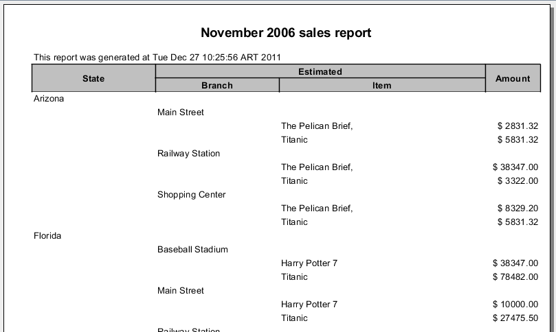

> Available since version 3.2.1

The idea is to have a column span header, like html tables.

For example:

| **State** | **Estimated** |     |
| --- | --- | --- |
| **Amount** | **Percentage** |
| Arizona | 600 | 30% |
| New York | 400 | 20% |
| Florida | 1000 | 50% |

In the following example, we are adding a colum span in the header of the column 2 to the column 3:

```java
DynamicReportBuilder drb = new DynamicReportBuilder();
...
AbstractColumn columnPercentageAmount = ColumnBuilder.getNew()
        .setPercentageColumn((PropertyColumn) columnAmount)
        .setTitle("Amount [%]").setWidth(new Integer(90))
        .setStyle(amountStyle).setHeaderStyle(headerStyle).build();
...
drb.addColumn(columnState);
drb.addColumn(columnBranch);
drb.addColumn(columnaItem);
drb.addColumn(columnaCantidad);
drb.addColumn(columnAmount);
drb.addColumn(columnPercentageAmount)
//Here set the colspan.
dbr.setColspan(2, 2, "Estimated");
...
```

**NOTE:** You may add first the cols after set the colspan.

Refer to [ColumnsSpanTest](https://github.com/intive-FDV/DynamicJasper/tree/master/src/test/java/ar/com/fdvs/dj/test/colspan/ColumnsSpanTest.java) for a working example.

The result is similar to:

