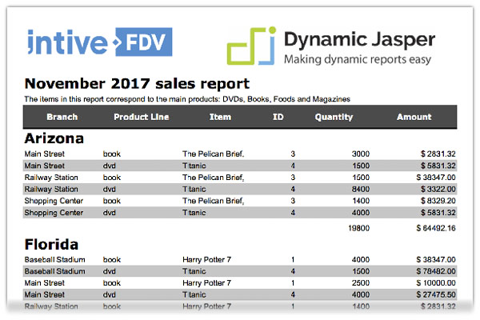

# Wecome to DynamicJasper
**DynamicJasper** (DJ) is an API that hides the complexity of [JasperReports](https://community.jaspersoft.com/project/jasperreports-library), it helps developers to save time when designing simple/medium complexity reports generating the layout of the report elements automatically. It creates reports dynamically, defining at run-time the columns, column width (auto width), groups, variables, fonts, charts, cross-tabs, sub reports (that can also be dynamic), page size and everything else that you can define at design time.

DJ keeps full compatibility with Jasper Reports since it’s a tool that helps create reports programmatically in an easy way (it only interferes with the creation of the report design doing the layout of the elements).

You can use the classic `.jrxml` files as templates while the content and layout of the report elements are handled by the DJ API.



Checkout the [getting started guide!]()

# Maven Dependency
```
<dependency>
    <groupId>ar.com.fdvs</groupId>
    <artifactId>DynamicJasper</artifactId>
    <version>5.3.8</version>
</dependency>
```
Check for the latest version in [Maven Central Repository](https://mvnrepository.com/artifact/ar.com.fdvs/DynamicJasper)

# Open Source and Free (as free beer!)

* GitHub [repository](https://github.com/intive-FDV/DynamicJasper)
* License:  GNU LESSER GENERAL PUBLIC LICENSE V.3 ([details](./license.md))

# Brought to you by
[](https://intive.com/)

